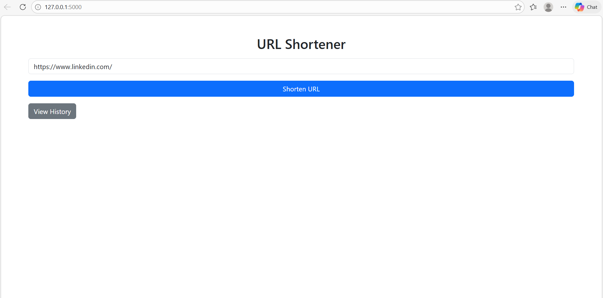
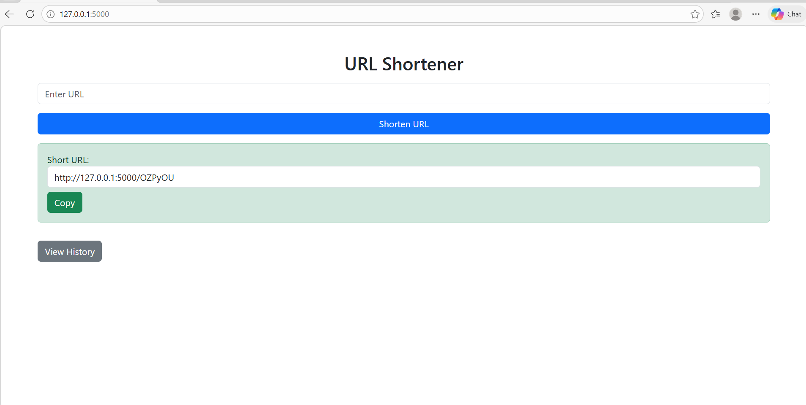
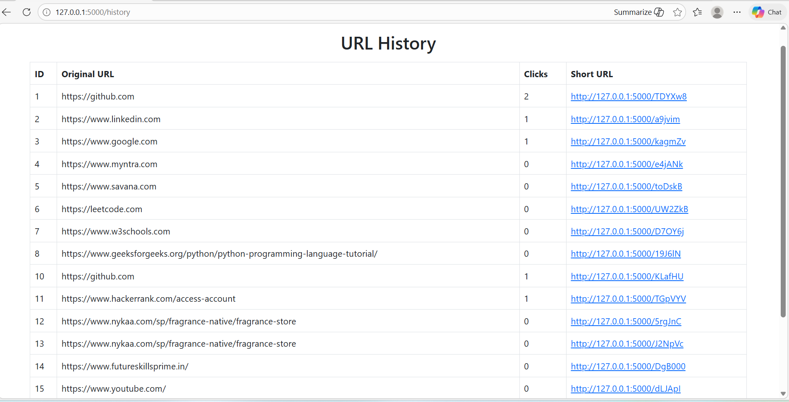

# URL Shortener (Flask)

A simple and efficient URL Shortener web application built using Flask.
It allows users to shorten long URLs, track click counts, and view history.

---

## Features

*  Shorten long URLs instantly
*  Track number of clicks (analytics)
*  View URL history
*  Fast and lightweight backend using Flask
*  SQLite database integration

---

## Tech Stack

* Python
* Flask
* SQLAlchemy
* HTML / CSS (Bootstrap)

---

## Screenshots

### Home Page



### Shortened URL Result



### History Page



---

## Installation

1. Clone the repository

```bash
git clone https://github.com/YOUR_USERNAME/url-shortener-flask.git
cd url-shortener-flask
```

2. Create virtual environment

```bash
python -m venv venv
venv\Scripts\activate   # Windows
```

3. Install dependencies

```bash
pip install -r requirements.txt
```

4. Run the app

```bash
python app.py
```

---

## Usage

* Enter a URL on the home page
* Click "Shorten URL"
* Use the generated short link
* Track clicks in history page

---

## Future Improvements

* Custom short URLs
* User authentication
* Deployment (Render / Railway)
* API support

---

## Author

Your Name
